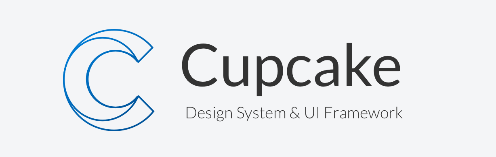

Project Cupcake is the internal Ipreo design system that brings together UX guidelines, an HTML/CSS framework, and Angular 2 components. This repository includes everything you need to build, customize, test, and deploy Cupcake. For complete documentation, visit the Cupcake website.

### Features
* **Feature A**: Lorem Ipsum.
* **Feature B**: Lorem Ipsum.

## Getting Started

Cupcake is currently published as two npm packages:

* __cupcake-core.__ Contains the static styles for building HTML components.
* __cupcake-angular.__ Contains the Angular 2 components. This package depends on cupcake-core for styles.


### Installing Cupcake Core

1. Install Cupcake-core package through npm:
    ```bash
    npm install cupcake --save
    ```

2. Include the cupcake.min.css in your HTML file:
    ```html
    <link rel="stylesheet" href="path/to/node_modules/cupcake/cupcake-core.min.css">
    ```

    If your site is built with [angular-cli](https://github.com/angular/angular-cli), you can achieve the above by adding the file to the styles array in 
    `angular-cli.json`:
    ```js
    "styles": [
        ...
        "../node_modules/cupcake/cupcake-core.min.css"
        ...
    ]
    ```

3. Write your HTML with the Cupcake CSS class names and markup.

## Documentation

For full documentation on the Cupcake Design System, including a list of components and example usage, see [our website](link).

## Contributing

The Cupacake team welcomes & encourages contributions. For more detailed information, see [CONTRIBUTING.md](link).


## Feedback 

If you find a bug or want to request a new feature, please open a [GitHub issue](link).
If possible please provide a minimal demo illustrating the issue with https://codepen.io
- Fork the Cupcake [codepen template](link) here and submit your link with the issue.
- 
### Community
**Slack:** Join the cupcake channel here: #.  
**Email:** @ .  
